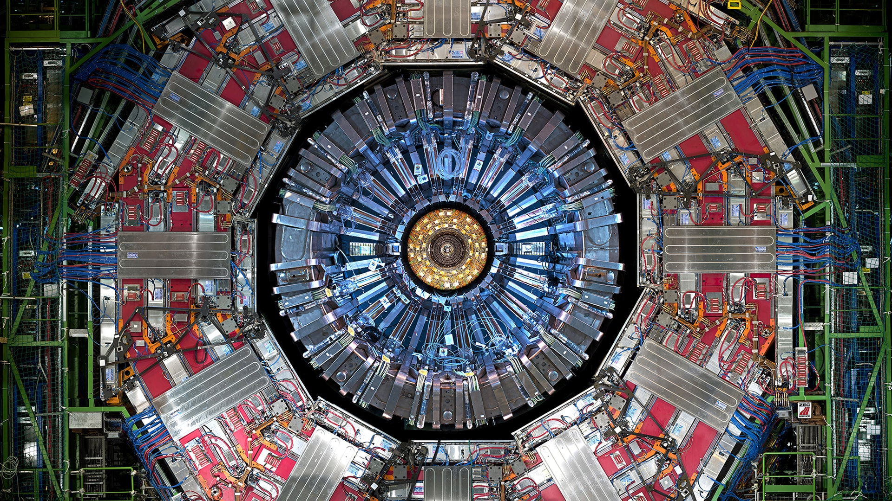

# Slurping through the Nuclear Soup: A CMS Dielectrons Analysis Journey.

## Introduction

<figure>

<figcaption> Figure 1: (Source: BETRA Kitchen).</figcaption>

</figure>

##

Imagine smashing two bowls of soup together while both bowls move at very high speeds. You can imagine the mess created by such a collision. Broccoli on the table, pieces of carrot on the floor, maybe some sweet corn on the fan, and all of those liquid parts in all over the place! However, imagine for some reason, you decided to take a bite from that broccoli on the table (although it is not recommended). Is it warm or cold? Does it have a sour flavour? Is it too salty or need a bit of salt? Does it have a thick layer of soup around it? The answer to such questions can tell a lot about the original bowl of soup. How did it taste? What were the ingredients/ spices? And so on. The same scenario can be reflected in particles produced in all directions upon collisions of protons that are accelerated in opposite directions. The characteristics of the products of the collisions can give useful information about the source of the collision. To put it together, the nucleus is nothing but a soup of particles that fly all over the place once collided (with the exception that the components of a soup cannot change upon collision, where on the other hand the nuclei collision can produce an ingredient that was not originally there due to energy and mass equivalence).

## Section 1: What is the CMS Detector?
The Compact Muon Solenid (CMS) is one of the largest experiments at the International Association for Nuclear Physics Research (CERN). The CMS detector is a huge 15m in diameter detector that weighs 
almost twice as much as the Eiffel Tower [1]. It is located at one of four points where two bunches of protons (or nuclei) collide together after being accelerated in the largest particle physics accelerator The Large Hadron Collider (LHC). The LHC is a 27 km in diameter tube buried 100 m underground that takes the particles to very high speeds approaching 99.9999991% of the speed of light! [2]

<figure>

<figcaption> Figure 2: The CMS detector at CERN (Source: CERN Accelerating science).</figcaption>

</figure>

##

The CMS detector has two main regions; the Endcaps region and the Barrel region. Each of these regions is supplied with subdetectors that aim to detect the different types of particles and characterize them. 
Figure 3 shows the two regions of the detector with the subdetectors installed (the definition of $\eta$ is being introduced in the next section). The subdetectors can widely differ in their technology and methods of detection based on the importance of events (we call the collision of two protons an "event"), radiation doses, overall weight and available space [3]. 

<figure>

<figcaption> Figure 3: The two regions of the CMS detector with their subdetectors (Source: m.bergauer.org).</figcaption>

</figure>

## Section 2: Introducing the CMS Coordinate System

A commonly used function of the particle's direction relative to the beam axis -or the three-momentum (p) direction- is referred to as "Psuedorapidity" ($\eta$). Another approximation used in place of pseudorapidity in the case of particles that have negligible masses (e.g. photons/neutrinos) is called "Rapidity" ($y$). These two definitions are given by:

$\eta = -\left[ \tan \left( \frac{\theta}{2} \right) \right]$, where $\theta$ is the angle measured from the positive direction of the beam (where the beam is moving).

$y = \frac{1}{2} \ln\left( \frac{E + p_{L}}{E - p_{L}} \right)$, where $p_{L}$ is the momentum component along the longitudinal direction.

Since electrons are not massless, the appropriate use in the coordinate system would be pseudorapidity as seen in Figure 4. The use of such quantities is more convenient since $\Delta \eta$ and $\Delta y$ are Lorentz invariant (i.e. they do not change with the change of the reference frame boost like that of the lab frame). The direction of the beam is defined to be the z-axis in Cartesian coordinates, the x-axis is at the center of the LHC, and the y-axis is in the perpendicular direction as seen in Figure 4. Another spacial coordinate is the $\phi$ azimuthal angle that is measured from the x positive axis in the xy plane [4].

<figure>

<figcaption> Figure 4: The CMS detector coordinate system (TikZ.net).</figcaption>

</figure>

## Section 3: Important Physical Quantities in Particle Collisions

The two most important conservation laws in physics are the conservation of energy and conservation of momentum laws. Through Einsten's famous equation $E = Mc^2$, the energy of the particle can be converted to mass and vice versa. Since the two collided bunches should have had almost the same momentum before the collision, the momentum in the center of mass frame of reference should be zero. Hence, the transverse component of momentum (the component of momentum in the xy plane) is usually more important for physics analysis. Some quantities often used are the following [4]:

* Momentum of the particles is defined by: $p = (p_{T}, \eta, \phi)$

* X-component of momentum: $p_{x} = p_{T}\cos\phi$

* Y-component of momentum: $p_{y} = p_{T}\sin\phi$

* Z-component of momentum: $p_{z} = p_{T}\sinh\eta$

* Total momentum: $|p| = p_{T}\cosh\eta$

* Transverse momentum: $p_{T} = \left[p_{x}^2 + p_{y}^2\right]^{1/2}$

* Invariant mass of two products interaction: $M = \left[(E_{1}+E_{2})^2-((p_{x1}+p_{x2})^2+(p_{y1}+p_{y2})^2+(p_{z1}+p_{z2})^2)\right]^{1/2}$

It is worth mentioning that the invariant mass is the mass of the source particle that the products were produced from. The invariant mass is nothing by a result of the relativistic dispersion equation which relates total energy, invariant mass and momentum as follows [5]: 

* $E_{T}^2 = (Mc^2)^2 + (pc)^2$ wich is basically: *Total energy = Rest mass energy + Relativistic energy*. 

A convention usually used in particle physics is to make $\hbar = c = 1$. This gives:

* $E_{T}^2 = M^2 + p^2 \rightarrow M = [E_{T}^2 - p^2]$.

## Section 4: The Standard Model of Particle Physics

You might have been fooled by your science teacher that the fundamental particles are protons, neutrons and electrons. However, today we have one of the most strong theories in physics which is called "The Standard Model of Particle Physics". It consists of the fundamental particles as fermions or bosons where bosons are the force carriers and fermions are the building blocks of matter. As seen in Figure 5, fermions are divided into quarks and leptons that come into generations of three particles. We also have some jargon for the combination of some of these elementary particles. These are some of them:

* Hadrons: it is a group of particles that contain at least two quarks [6].

* Mesons: are particles with an intermediate-mass (between that of an electron and that of a proton) that is made of an equal number of quarks and antiquarks bounded together by the strong nuclear force [7].

* Baryons: are particles made of an odd number of valence quarks [8].

* Charmions: the mesons that consist of a charm quark and a charm antiquark bounded together [9].

<figure>

<figcaption> Figure 5: The standard model of particle physics (Source: Medium.com).</figcaption>

</figure>

## Section 5: Interactions of Study

In this dielectron analysis, three particles are of main interest: $J/\Psi$ meson, $Y$ meson and the $Z$ boson. As seen from Figure 6, the Feynmann diagram of the interaction of each particle shows that the final state of these interactions is a dilepton. From Figure 5, electrons as well as leptons belong to the family of leptons. Hence, both of these leptons can be the result of $J/\Psi$, $Y$ and Z particles interaction. It is worth noting that the interaction that involves the Z boson here is called the Drell-Yan interaction [10]. The events of this interaction are usually considered as a background noise for the resonant particle signal that is under the interest of study. In this analysis, the Drell-Yan interaction via the Z boson is considered to be an event of interest, while the same interaction via the virtual photons is considered to be part of the background noise. Each of the resonant particle signals gives:

* $J/\Psi$ Meson: a meson formed by the binding of a charm quark and a charm antiquark "Charmonium" [11].

* $Y$ Meson: a meson that consists of a bottom quark and a bottom antiquark [12].

* $Z$ Boson: an elementary particle in the standard model that carries the weak nuclear force together with $W^+$ and $W^-$ boson [13].

<figure>

<figcaption> Figure 6: Fynmenn diagrams of the three interactions of the analysis interest.</figcaption>

</figure>

## Section 6: A Flavour of Inferential Statistics

A bell-shaped plot that can be seen almost everywhere in statistics is called a normal distribution (or sometimes called Gaussian distribution). It is defined as [14]:

$f(x) = \frac{1}{\sigma\sqrt(2\pi)} \exp(\frac{-(x-\mu)^2}{2\sigma^2})$,

where $\sigma$ is the standard deviation, $\mu$ is the mean of the distribution and $\sigma^2$ is the variance.

In normally distributed data of a certain quantity, an empirical rule that describes the distribution states:

- 68.27% of the data lies in the $1\sigma$ of the distribution,
- 95.45% of the data lies within $2\sigma$,
- and 99.73% of the data lies in the $3\sigma$.

<figure>

<figcaption> Figure 7: The normal distribution with the imperical rule (Source: Medium.com).</figcaption>

</figure>

##

In physics analysis, no particle discovery can be confirmed unless the bump of the particle is evident with a $5\sigma$ certainty [15]. The standard deviation is also used to find the resolution of the detectors [16]. On the other hand, sometimes the distribution of the quantity measured by the detector is skewed compared to the normal distribution. In such cases, the distribution must first transform before it can be used for the Gaussian fitting. Examples of transformations usually used involve: log, square-root, polynomial, exponential and more. Another useful transformation called the "Box-Cox" can sometimes be used as a generalization for the aforementioned types of transformation [17]. Box-Cox transformation is defined as:

<figure>

</figure>

These are some special cases of the Box-Cox transformation:

* $\lambda = 0$: Logarithmic distribution.
* $\lambda = 0.5$: Square root distribution.
* $\lambda = 1$: No transformation.

Many tests in statistics can be applied to the data to test whether it follows a normal distribution or not. A visual test can often be used to compare the distribution of the data relative to the normal is called the 'Quantile-Quantile' plot (or Q-Q plot). Quantiles are the lines that divide the data points into equal groups. For example, the median line of a distribution is a 50% quantile (or a 0.5 quantile), while a 0.25 quantile is where 25% of the data is located [18]. Some examples that exhibit different skewed distribution scenarios are shown in Figure 6.

<figure>

<figcaption> Figure 8: The Q-Q plot of different data distributions (The University of Sydney).</figcaption>

</figure>

## Problem Statement and Approach
The aim of this analysis is *to characterize the source interactions of dielectron and use them as probes for CMS overall structure*. The analysis involves the study of:

1 - The mass of dielectron source particles. 
2 - Dominance of interactions in quantity, transverse momentum and spatial distribution. 

As probes:

3 - Important events dominance in Barrel versus Endcaps region. 
4 - The Invariant mass resolution of both regions. 

## Resources

[1] Detector Overview. (n.d.). https://cms.cern/book/export/html/1193 
[2] Facts and figures about the LHC | CERN. (2024, July 18). https://home.cern/resources/faqs/facts-and-figures-about-lhc 
[3] Peña, C. H. (2019). Precision Timing with the CMS MIP Timing Detector. Journal of Physics Conference Series, 1162, 012035. https://doi.org/10.1088/1742-6596/1162/1/012035 
[4] Wikipedia contributors. (2024, May 8). Pseudorapidity. Wikipedia. https://en.wikipedia.org/wiki/Pseudorapidity 
[5] Wikipedia contributors. (2024b, August 18). Energy–momentum relation. Wikipedia. https://en.wikipedia.org/wiki/Energy%E2%80%93momentum_relation 
[6] Wikipedia contributors. (2024b, May 13). Hadron. Wikipedia. https://en.wikipedia.org/wiki/Hadron 
[7] Wikipedia contributors. (2024c, July 19). Meson. Wikipedia. https://en.wikipedia.org/wiki/Meson 
[8] https://en.wikipedia.org/wiki/Baryon 
[9] Wikipedia contributors. (2024e, August 17). Charm quark. Wikipedia. https://en.wikipedia.org/wiki/Charm_quark 
[10] Wikipedia contributors. (2024a, January 29). Drell–Yan process. Wikipedia. https://en.wikipedia.org/wiki/Drell%E2%80%93Yan_process 
[11] Wikipedia contributors. (2023, September 21). J/psi meson. Wikipedia. https://en.wikipedia.org/wiki/J/psi_meson 
[12] https://en.wikipedia.org/wiki/Upsilon 
[13] Wikipedia contributors. (2024e, June 17). W and Z bosons. Wikipedia. https://en.wikipedia.org/wiki/W_and_Z_bosons 
[14] Normal Distribution | Examples, Formulas, & Uses. (2020, October 23). Scribbr. Retrieved August 20, 2024, from https://www.scribbr.com/statistics/normal-distribution/ 
[15] Why do physicists mention “five sigma” in their results? | CERN. (2024, July 18). https://home.cern/resources/faqs/five-sigma#:~:text=Five%20sigma%20is%20considered%20the,of%20a%20claim%20being%20false. 
[16] Cowan, G. (n.d.). Statistical methods for Particle physics. https://www.pp.rhul.ac.uk/~cowan/stat_aachen.html 
[17] Plummer, A. (2022, September 16). Box-Cox transformation and target variable: explained. Built In. https://builtin.com/data-science/box-cox-transformation-target-variable 
[18] StatQuest with Josh Starmer. (2017, November 6). Quantiles and percentiles, clearly explained!!! [Video]. YouTube. https://www.youtube.com/watch?v=IFKQLDmRK0Y 
